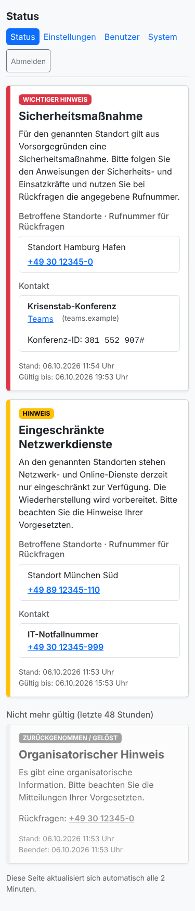
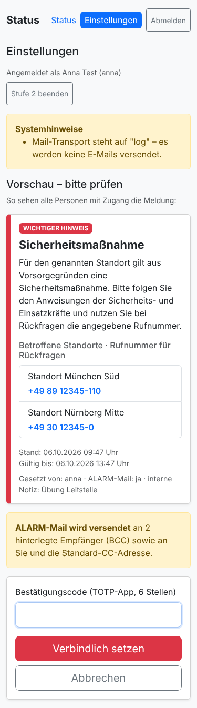
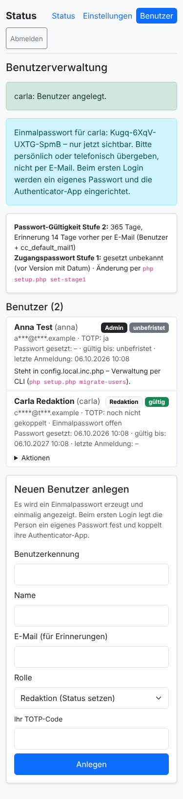

# Status-BCM

**Die kleine Notfall-Statusseite für Unternehmen und Behörden.** Im Ernstfall sehen alle Beschäftigten auf einen
Blick, was gilt: "Regelbetrieb", "Standort vorübergehend nicht zugänglich", "Eingeschränkte telefonische
Erreichbarkeit" und dazu, wo sie anrufen können. Gesetzt wird der Status von wenigen Berechtigten, nachweisbar und
fälschungssicher.

Status-BCM läuft auf jedem einfachen PHP-Webspace, bewusst **außerhalb** der eigenen IT. So bleibt die Seite
erreichbar, wenn Netzwerk, Telefon oder Mail im Haus gestört sind.

<p>
  
  
  
  
  
</p>

## Was es kann

* **Ein Anmeldeformular, zwei Stufen:** gemeinsamer Benutzername + Zugangspasswort zum Lesen, persönliche Kennung
  mit TOTP-Code zum Ändern (kritische Änderungen und das Beenden echter Warnungen zusätzlich je Aktion mit TOTP).
* **Keine Falschmeldungen:** nur freigegebene, pressetaugliche Textbausteine; immer Vorschau → verbindlich setzen;
  TOTP-Bestätigung bei ALARM-Mail und kritischen Status; kritische Begriffe ("Ausfall", "Angriff", …) werden
  blockiert.
* **Mehrere Meldungen gleichzeitig** (z. B. Netzwerk an Standort A, Sicherheitsmaßnahme an Standort B), je mit
  **Dauer oder "Gültig bis"**; abgelaufene oder beendete Meldungen bleiben 48 Stunden ausgegraut sichtbar
  ("Nicht mehr gültig" bzw. "Zurückgenommen / gelöst"). Erinnerungsmail bei Ablauf, bis verlängert oder beendet wird.
* **Standorte mit Rückrufnummer** und **Kontakte** je Meldung: Notfallnummer, E-Mail oder Videokonferenz.
* **ALARM-Mail** per BCC an gewählte **Alarmkreise** (z. B. IT, BOA/Krisenstab, Leitung) und die Standortverwaltung
  der betroffenen Außenstellen, mit einstellbarem Betreff-Präfix für neu, Aktualisierung und Ende. Die Adressen sind
  verschlüsselt und nirgends im Klartext sichtbar.
* **Weitere Alarmkanäle:** zusätzlich **Signal** (über eine eigene signal-cli-rest-api) und **GroupAlarm** je
  Alarmkreis, damit die Alarmierung auch ohne die eigene Mail-Infrastruktur ankommt.
* **Selbstüberwachung:** Warnung bei Cron-Ausfall (Hinweis, Prüfung, Warnmail) und `health.php` für einen externen
  Uptime-Check.
* **Aushang:** druckbare A4-Seite mit QR-Code zur Statusseite für Schwarzes Brett und Notfallordner.
* **Protokoll-Export** als CSV und PDF für Revision und ISB, mit Integritätsprüfung und Kopf-Hash.
* **Revisionssicheres Protokoll:** wer, was, wann, wie; Hash-Kette mit HMAC, append-only per DB-Trigger, täglicher
  Audit-Anker per Mail.
* **Verschlüsselte Ablage** (AES-256-GCM) von Meldungen, Standortdaten, Mail-Inhalten, Protokolldetails und
  Benutzerdaten.
* **Benutzerverwaltung** mit Rollen (Redaktion / Admin), Einmalpasswort, Selbst-Einrichtung der Authenticator-App per
  QR-Code, Passwort-Gültigkeit mit Erinnerungsmail.
* **Komplett im Browser bedienbar:** Einrichtungsassistent, Systemseite (Alarmkreise, Standorte, Kontakte, Präfixe,
  Zugangspasswort, Cron, Prüfung, Testmail) und Notfallzugang per FTP-Datei. Eine Kommandozeile ist nicht nötig.
* **Nutzung auswerten:** Anmeldungen je Stufe und Benutzer, anonymer Lesezähler je Status.
* **Mobile First** mit Bootstrap 5.3 (lokal, nur CSS), **ohne JavaScript**, etwa 3 KB je Seitenaufruf.
* **Keine Abhängigkeiten:** PHP ≥ 8.0, MySQL/MariaDB, kein Composer, kein CDN, eigener SMTP-Client mit
  Zertifikatsprüfung.

## Schnellstart (ohne Kommandozeile)

1. Datenbank und Absender-Postfach im Kundenmenü des Hosters anlegen.
2. ZIP herunterladen, entpacken und per FTP hochladen (ohne `tests/` und `docs/`), leeren Ordner `storage` anlegen.
3. Die Adresse der Seite aufrufen. Der **Einrichtungsassistent** fragt nach einem Code aus `storage/`, dann nach
   Datenbank, Mailserver, Zugangspasswort, erstem Admin und Empfängern, und sperrt sich danach selbst.
4. Anmelden und die **Authenticator-App per QR-Code** koppeln.
5. Unter **System** die Cron-Adresse beim Hoster eintragen (alle 5 Minuten) und die Prüfung ansehen.

Die ausführliche Anleitung steht in **[docs/01-installation.md](docs/01-installation.md)**. Mit SSH geht alles auch per
`php setup.php …`.

## Dokumentation (Wiki)

| | |
|---|---|
| [Installation](docs/01-installation.md) | vom leeren Webspace bis zum ersten Status |
| [Konfiguration](docs/02-konfiguration.md) | alle Einstellungen, Status-Katalog, Regeln für Meldungstexte |
| [Bedienung](docs/03-bedienung.md) | für Beschäftigte, Redaktion und Admins, mit Notfall-Kurzkarte |
| [Betrieb](docs/04-betrieb.md) | Routine, Updates, Backup, Notfälle, nginx, DB-Härtung |
| [Sicherheit und Audit](docs/05-sicherheit-und-audit.md) | Schutzbedarf, Maßnahmen nach BSI IT-Grundschutz, Protokollierung, wo was wie gespeichert und verschlüsselt ist, Restrisiken, Prüfanleitung |
| [Governance](docs/06-governance.md) | Unterlagen für BSI-Grundschutz, ISB, ISMS (Strukturanalyse, Schutzbedarfsfeststellung, IT-Sicherheitskonzept, Risikoanalyse), BCM und Datenschutz |

## Aufbau

| Datei | Zweck |
|---|---|
| `index.php` | Anmeldung: gemeinsamer Zugang (nur Lesen) oder persönliche Kennung (mit Einstellungen) |
| `status.php` | aktueller Status |
| `change.php` | Login Stufe 2, Meldungen setzen, verlängern, ändern, beenden (Formular → Vorschau → verbindlich), Verlauf, Protokoll, Nutzung, eigenes Passwort |
| `admin.php` | Benutzerverwaltung (nur Admins) |
| `system.php` | System (nur Admins): Prüfung, Cron-Adresse, Alarmkreise mit Signal/GroupAlarm, Standorte mit E-Mail der Standortverwaltung, Kontakte, Betreff-Präfixe, Kopie-Adresse, Zugangspasswort, Protokoll-Export, Testmail |
| `aushang.php` | druckbarer Aushang mit QR-Code (persönliche Anmeldung) |
| `export.php` | Protokoll-Export CSV/PDF (nur Admins) |
| `health.php` | Gesundheitsprüfung für externe Uptime-Dienste (200 `ok` / 503) |
| `pdf.inc.php` | kleiner PDF-Schreiber für den Export (ohne Bibliotheken) |
| `install.php` | Einrichtungsassistent (sperrt sich nach der Einrichtung) und Notfallzugang |
| `qr.inc.php` | QR-Code als SVG für die Authenticator-App (ohne externe Dienste) |
| `cron.php` | Erinnerungen, Passwort-Erinnerungen, Audit-Anker, Aufräumen (CLI oder URL mit Token) |
| `setup.php` | optional: dieselben Aufgaben per Kommandozeile |
| `lib.inc.php` | gesamte Logik |
| `config.inc.php` | Einstellungen mit Platzhaltern; echte Werte in `config.local.inc.php` (nicht im Git) |
| `config.json` | Status-Katalog, Start-Standorte, Mail-Vorlagen, kritische Begriffe |
| `assets/` | Bootstrap 5.3.8 (MIT-Lizenz) und `app.css` |
| `tests/` | `selftest.php` (SQLite/MySQL), `webtest.php` (Ablauf über `php -S`), `installtest.php` (Einrichtung im Browser) |

## Tests

```bash
php tests/selftest.php
php tests/webtest.php
php tests/installtest.php
```

## Grenzen

Ein einzelner Webspace ist kein hochverfügbares Krisensystem. Halten Sie einen Rückfallweg ohne die Seite vor
(Telefonkette, Aushang) und üben Sie den Ablauf regelmäßig mit dem Status "Übung".

## Lizenz

Bootstrap: MIT, © The Bootstrap Authors (`assets/bootstrap.LICENSE`).
