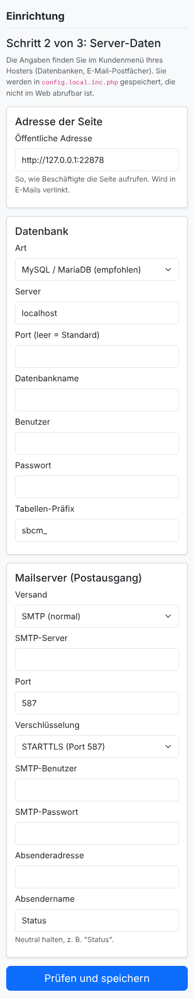
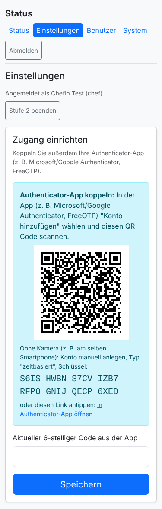
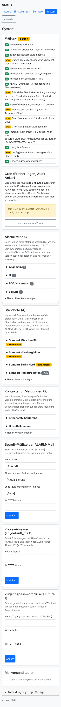

# Installation und Ersteinrichtung

Diese Anleitung führt vom leeren Webspace bis zum ersten gesetzten Status. Sie brauchen **keine Kommandozeile**:
Dateien laden Sie per FTP oder Dateimanager des Hosters hoch, alles andere erledigt der Einrichtungsassistent im
Browser. Wer SSH hat, findet die Befehle am Ende unter [Alternative: Kommandozeile](#alternative-kommandozeile).

## 1. Voraussetzungen

| Was | Mindestens |
|---|---|
| PHP | 8.0, mit den Erweiterungen `openssl`, `pdo_mysql`, `mbstring` (bei fast allen Hostern Standard) |
| Datenbank | MySQL 5.7+ oder MariaDB 10.3+, eine eigene Datenbank und ein eigener Benutzer |
| Webserver | Apache mit `.htaccess` (auf nginx siehe [Betrieb](04-betrieb.md#nginx)) |
| HTTPS | Pflicht (z. B. Let's Encrypt über den Hoster) |
| Mail | ein SMTP-Postfach für den Absender, z. B. `status@ihre-domain.de` |
| Cron | Cronjob im Kundenmenü des Hosters ("URL aufrufen") **oder** ein externer Cron-Dienst |
| Zugang | FTP/SFTP oder der Dateimanager des Hosters |

Empfehlung: eine eigene, neutrale Subdomain wie `status.ihre-domain.de`, ohne Behörden- oder Konzernnamen im Titel.

## 2. Datenbank und Postfach anlegen (Kundenmenü des Hosters)

1. Eine neue MySQL-Datenbank anlegen, z. B. `statusbcm`, mit eigenem Benutzer und langem Zufallspasswort.
2. Rechte: `SELECT, INSERT, UPDATE, DELETE, CREATE, ALTER, INDEX, TRIGGER`. Ohne `TRIGGER` funktioniert alles, die
   Append-only-Sperre des Protokolls entfällt dann aber (die Hash-Kette erkennt Manipulation weiterhin).
3. Ein Postfach für den Absender anlegen, z. B. `status@ihre-domain.de`.
4. Notieren: Datenbank-Server, Datenbankname, Benutzer, Passwort; SMTP-Server, Port, Benutzer, Passwort.

## 3. Dateien hochladen

1. Auf GitHub **Code → Download ZIP** wählen und das ZIP auf dem eigenen Rechner entpacken.
2. Per SFTP/FTPS (nicht unverschlüsseltes FTP) oder Dateimanager in das Verzeichnis der Subdomain hochladen:

```
.htaccess  robots.txt  index.php  status.php  change.php  admin.php  system.php  install.php  cron.php
setup.php  lib.inc.php  qr.inc.php  config.inc.php  config.json  assets/
```

**Nicht** hochladen: `tests/`, `docs/`, `.git/`, `README.md`.

3. Einen leeren Ordner `storage` neben `index.php` anlegen und ihm Schreibrechte geben (`0755`, falls das nicht reicht
   `0775`). Besser noch: `storage` außerhalb des Webroots (siehe [Konfiguration](02-konfiguration.md)).
4. `config.json` auf schreibgeschützt setzen (`0444`).

Vorher anpassen oder später austauschen: `config.json` mit `default_phone` und der Rufnummer im Status
"Eingeschränkte telefonische Erreichbarkeit". Siehe [Konfiguration](02-konfiguration.md). Die Meldungstexte werden
bewusst nicht im Browser bearbeitet: Wer sie ändern will, braucht Dateizugriff. Standorte samt E-Mail der
Standortverwaltung, Alarmkreise und Kontakte pflegen Sie nach der Einrichtung unter **System**.

## 4. Einrichtungsassistent

`https://status.ihre-domain.de/` aufrufen. Solange nichts eingerichtet ist, öffnet sich automatisch
`install.php`.

**Schritt 1: Voraussetzungen und Einrichtungscode.** Der Assistent prüft PHP, Erweiterungen und Schreibrechte.
Zum Schutz vor Fremden, die die Seite zufällig vor Ihnen finden, legt er im Ordner `storage` eine Datei
`install-code-….txt` an. Öffnen Sie sie per FTP oder Dateimanager und geben Sie den Code ein. Nur wer Zugriff auf den
Webspace hat, kann ihn lesen.

**Schritt 2: Server-Daten.** Adresse der Seite, Datenbank und Mailserver eintragen. Der Assistent prüft die
Datenbankverbindung, erzeugt den **Master-Key** und den **Cron-Token** und speichert alles in
`config.local.inc.php`.
Darf PHP auf Ihrem Webspace keine Dateien im Programmordner schreiben (das ist sicherer), bietet der Assistent die
Datei zum **Herunterladen** an: Laden Sie sie unter dem Namen `config.local.inc.php` neben `index.php` hoch und tippen
Sie auf "Weiter".



**Schritt 3: Zugänge.**

| Feld | Bedeutung |
|---|---|
| Gemeinsamer Zugang (Stufe 1) | Benutzername (z. B. "Unternehmen", Standard "zugang") und Passwort aller Beschäftigten zum Lesen (mind. 10 Zeichen) |
| Erster Admin | Kennung, Name, E-Mail, eigenes Passwort (mind. 12 Zeichen, gern ein Satz) |
| Kopie-Adresse | `cc_default_mail1`: Erinnerungen, Kopie der ALARM-Mails, täglicher Audit-Anker (z. B. ISB) |
| ALARM-Empfänger | optional, eine Adresse je Zeile; landen im Alarmkreis "Allgemein". Weitere Kreise später unter **System** |

Nach "Einrichtung abschließen" legt der Assistent die Tabellen an, speichert die Werte verschlüsselt in der
Datenbank, protokolliert die Einrichtung, **löscht die Code-Datei und sperrt sich dauerhaft**. `install.php` darf
danach vom Webspace gelöscht werden.

## 5. Erste Anmeldung und Authenticator-App

1. Startseite → Kennung und Passwort des Admins eingeben (nicht den gemeinsamen Zugang).
2. Es öffnet sich **Einstellungen → Zugang einrichten**.
3. Die Seite zeigt einen **QR-Code**. In der Authenticator-App (Microsoft Authenticator, Google Authenticator,
   FreeOTP, Aegis, …) "Konto hinzufügen" → QR-Code scannen. Ohne Kamera, etwa am selben Smartphone: den darunter
   angezeigten Schlüssel abtippen oder den Link antippen.
4. Den aktuellen 6-stelligen Code eingeben → **Speichern**.



Der QR-Code wird auf dem Server erzeugt. Das Secret geht an keinen fremden Dienst.

## 6. Cron einrichten

Der Cron verschickt Erinnerungen bei Ablauf, Passwort-Erinnerungen und den täglichen Audit-Anker. Ohne ihn gibt
es **keine Erinnerungsmails**.

1. Unter **System** steht die Cron-Adresse `https://status.ihre-domain.de/cron.php?t=…`.
2. Im Kundenmenü des Hosters unter "Cronjobs" einen Job **alle 5 Minuten** anlegen, Typ "URL aufrufen", mit genau
   dieser Adresse. Hat der Hoster keine Cronjobs, nutzen Sie einen externen Cron-Dienst.
3. Die Antwort `ok` bedeutet: Der Lauf war erfolgreich. Unter **System** erscheint "Cron läuft" mit der Uhrzeit des
   letzten Laufs.

Fällt der Cron später aus, warnt die Seite selbst (siehe [Betrieb → Überwachung](04-betrieb.md#überwachung)).
Richten Sie dort auch gleich den externen Uptime-Check auf `health.php` ein.

Die Adresse enthält ein Geheimnis. Tragen Sie sie nur beim Cron-Dienst ein. Wer sie kennt, kann nur den Cron auslösen
(Erinnerungen, Aufräumen), aber nichts lesen oder ändern. Optional schränkt `cron.ip_allowlist` die Absender ein.

## 7. Prüfen



1. **System → Prüfung**: Alle Punkte sollen "ok" zeigen.
2. **System → Mailversand testen**: Die Testmail muss ankommen.
3. Diese Adressen dürfen nichts liefern (403/404): `/config.json`, `/lib.inc.php`, `/config.local.inc.php`,
   `/setup.php`, `/storage/`, `/tests/`.
4. Eine Meldung "Übung" mit ALARM-Mail setzen (siehe [Bedienung](03-bedienung.md)), Empfang prüfen und die Meldung
   wieder beenden.
5. Optional Signal und GroupAlarm einrichten ([Betrieb](04-betrieb.md#weitere-alarmkanäle-signal-und-groupalarm)) und
   den Aushang mit QR-Code drucken (**System → Aushang drucken**).

## 8. Sichern

`config.local.inc.php` per FTP herunterladen und **getrennt sicher aufbewahren** (Passwortmanager oder Tresor der
Notfallorganisation). Sie enthält den Master-Key; ohne ihn sind Status, Protokoll und Einstellungen nicht mehr
lesbar. Siehe [Betrieb → Datensicherung](04-betrieb.md#datensicherung-und-wiederherstellung).

## 9. Weitere Benutzer

Im Browser unter **Benutzer** (nur Admins) anlegen. Die Person erhält ein Einmalpasswort und richtet beim ersten
Login ihr eigenes Passwort und die Authenticator-App per QR-Code selbst ein. Siehe
[Bedienung → Benutzerverwaltung](03-bedienung.md#benutzerverwaltung-admins).

## Alternative: Kommandozeile

Mit SSH-Zugang lässt sich alles auch per `setup.php` erledigen. Die Befehle schreiben in dieselben Speicherorte wie
der Browser, beide Wege lassen sich mischen.

```bash
php tests/selftest.php                                   # Selbsttest
php setup.php init                                       # Master-Key + Cron-Token → config.local.inc.php
# config.local.inc.php: base_url, db.*, mail.* eintragen
php setup.php set-stage1                                 # Zugangspasswort Stufe 1
php setup.php set-stage1-user Unternehmen                # Benutzername des gemeinsamen Zugangs
php setup.php add-user chef "Vorname Nachname" chef@firma.de admin
php setup.php add-recipient alarm1@firma.de              # ALARM-Empfänger (Kreis "Allgemein")
php setup.php set-cc1 isb@firma.de                       # Kopie-Adresse
php setup.php check                                      # Gesamtprüfung
```

Cron per Kommandozeile: `*/5 * * * * php /pfad/zu/cron.php`. Alle Befehle: [Betrieb](04-betrieb.md#befehlsübersicht-setupphp-optional).
