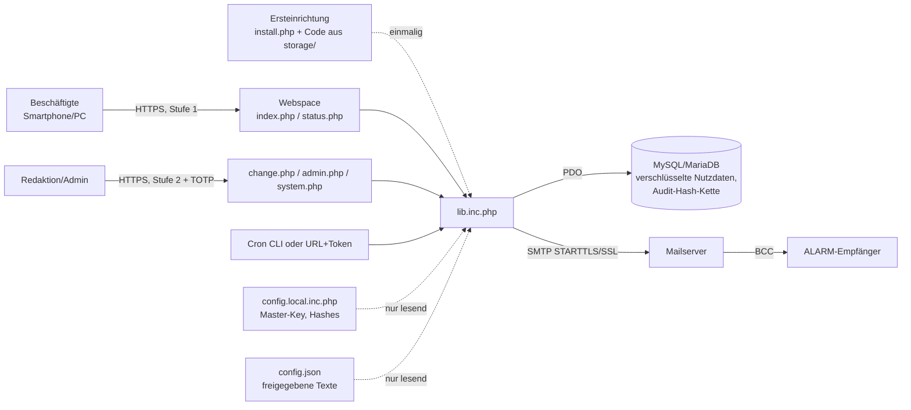

# Sicherheits- und Auditdokumentation

Diese Dokumentation beschreibt Schutzbedarf, technische Maßnahmen, Nachweise und Restrisiken von Status-BCM. Sie
orientiert sich am **BSI IT-Grundschutz-Kompendium** und am **BSI-Standard 200-4 (Business Continuity Management)**.
Sie ist als Grundlage für ein Audit oder eine Sicherheitskonzeption gedacht.

> **Wichtig:** Software allein ist nicht "BSI-zertifiziert" oder "BSI-konform". Konformität entsteht erst
> zusammen mit den organisatorischen Maßnahmen des Betreibers: Rollen, Freigaben, Schulung, Notfallhandbuch,
> Hosting-Vertrag, Datensicherung. Die Tabellen unten zeigen, was die Software technisch abdeckt und was organisatorisch
> beim Betreiber bleibt (Spalte "Betreiber").

Stand: Version 1.1 · Verantwortlich für die Pflege dieser Datei: Informationssicherheitsbeauftragte/r (ISB)

---

## 1. Zweck und Abgrenzung

Status-BCM ist eine kleine Notfall-Informationsseite. Beschäftigte sehen nach einem gemeinsamen Zugangspasswort den
aktuellen Betriebsstatus, z. B. "Standort vorübergehend nicht zugänglich", mit Rückrufnummern. Berechtigte Personen
setzen den Status nach persönlicher Anmeldung, Vorschau und TOTP-Bestätigung. Optional wird eine ALARM-Mail versendet.

**Im Geltungsbereich:** die Anwendung (PHP-Dateien, `config.json`, Datenbankschema), ihre Konfiguration und ihre
Protokolle.

**Nicht im Geltungsbereich:** Webspace und Betriebssystem des Hosters, das DNS, das Mailsystem der Empfänger sowie
die Endgeräte der Nutzenden.

**Rolle im BCM (BSI-Standard 200-4):** Status-BCM ist ein **Krisenkommunikationsmittel**. Es läuft bewusst außerhalb
der eigenen IT-Infrastruktur, auf einem externen Webspace, damit es auch bei deren Ausfall erreichbar bleibt. Es
ersetzt keine Alarmierungskette und keinen Notfallplan, es ergänzt sie. Ein Rückfallweg ohne die Seite (Telefonkette,
Aushang) ist vorzuhalten.

## 2. Schutzbedarf

| Grundwert | Schutzbedarf | Begründung |
|---|---|---|
| Integrität | **hoch** | Eine gefälschte Statusmeldung ("Standort gesperrt") kann Personen gefährden, Abläufe stören und Reputationsschaden verursachen. |
| Verfügbarkeit | **hoch** (im Ereignisfall) | Die Seite wird gerade dann gebraucht, wenn andere Kanäle gestört sind. |
| Vertraulichkeit | **normal** bis **hoch** | Statusmeldungen sind auf "könnte öffentlich werden" ausgelegt. Empfängerlisten, Benutzerdaten und Protokolle sind vertraulich. |

Daraus folgen die Schwerpunkte: Änderungen nur durch Berechtigte und nachweisbar, Manipulation erkennbar,
Meldungstexte pressetauglich, schlanker Betrieb ohne Abhängigkeiten.

## 3. Architektur und Datenflüsse

**Vertrauensgrenzen:** Browser ↔ Webspace (HTTPS), Webspace ↔ Datenbank, Webspace ↔ Mailserver. Die Schlüssel liegen
in einer Datei (`config.local.inc.php`), nicht in der Datenbank. Im Browser gepflegte Einstellungen (Zugangspasswort,
Empfänger, Kopie-Adresse) liegen zwar in der Datenbank, aber mit AES-GCM verschlüsselt und an ihren Namen gebunden. Wer nur die Datenbank kontrolliert, kann deshalb
nichts unbemerkt fälschen (Abschnitt 5.4).

## 4. Rollen und Berechtigungen

| Rolle | Anmeldung | Darf |
|---|---|---|
| Beschäftigte | Stufe 1: gemeinsames Zugangspasswort | Aktuellen Status lesen |
| Redaktion (`editor`) | Stufe 1 + Stufe 2 (persönlich) | Status setzen, verlängern, beenden; ALARM-Mail auslösen (mit TOTP); Verlauf, Protokoll und Nutzung einsehen; eigenes Passwort ändern |
| Admin (`admin`) | wie Redaktion | zusätzlich Benutzerverwaltung (`admin.php`): anlegen, Passwort/TOTP zurücksetzen, Rolle ändern, (de)aktivieren; System (`system.php`): Zugangspasswort Stufe 1, ALARM-Empfänger, Kopie-Adresse; Änderungen jeweils mit TOTP; Prüfung, Cron-Adresse, Testmail |
| Betrieb (FTP, optional Shell) | Zugang zum Webspace | Ersteinrichtung (`install.php` mit Einrichtungscode aus `storage/`), `config.json` und `config.local.inc.php` pflegen, Sicherung; optional `setup.php` |

* **Need-to-know:** Empfängeradressen sieht niemand in der Oberfläche, nur die Anzahl bzw. maskiert (`m****@e***.de`).
* **Vier-Augen-Prinzip:** Die Software erzwingt kein Vier-Augen-Prinzip beim Setzen eines Status, weil das im
  Ernstfall Zeit kostet. Es gilt aber für Änderungen an `config.json` (Git, Pull Request) und organisatorisch für die
  Benutzerverwaltung. *Betreiber:* bei Bedarf in der Notfallorganisation festlegen.
* Benutzer werden **nie gelöscht**, nur deaktiviert. Das stellt ein DB-Trigger sicher. So bleiben alle Einträge im
  Protokoll einer Person zuordenbar.

## 5. Technische Maßnahmen

### 5.1 Identifikation und Authentisierung (Bezug: ORP.4 Identitäts- und Berechtigungsmanagement)

| Maßnahme | Umsetzung |
|---|---|
| Zwei Stufen | Stufe 1 schützt vor Crawlern und Zufallszugriffen. Stufe 2 ist persönlich und Voraussetzung für jede Änderung. |
| Passwortspeicherung | `password_hash()` (bcrypt), nie im Klartext; Vergleich in konstanter Zeit; Dummy-Hash gegen User-Enumeration. |
| Passwortregeln | mind. 12 Zeichen (Länge vor Komplexität, Passphrasen erlaubt), nicht der Benutzername, mind. 6 verschiedene Zeichen, nicht gleich dem bisherigen. |
| Passwort-Gültigkeit | konfigurierbar (`auth.password_max_age_days`, Standard 365 Tage). Erinnerung per Mail vorher, wöchentlich wiederholt. Ein abgelaufenes Passwort sperrt **nicht** aus, erzwingt aber den sofortigen Wechsel. Eine Aussperrung im Ernstfall wäre ein BCM-Risiko. Das BSI verlangt keinen regelmäßigen Zwangswechsel; ein Wert von 0 schaltet den Ablauf ab. |
| Ersteinrichtung | Neue Benutzer erhalten ein Einmalpasswort (einmalig angezeigt, persönlich zu übergeben). Beim ersten Login werden ein eigenes Passwort und die Authenticator-App eingerichtet. Admins sehen das TOTP-Secret nie. |
| Zweiter Faktor | TOTP nach RFC 6238 (Authenticator-App, ohne SMS/Mail), ±30 s Toleranz, **Replay-Schutz** (jeder Zeitschritt nur einmal je Benutzer). Pflicht bei ALARM-Mail, bei Status mit `require_totp` und bei jeder Admin-Aktion; optional für alle Änderungen (`auth.totp_enforce_all`). |
| Brute-Force-Schutz | Fehlversuche je IP und je Benutzer (Standard 5 bzw. 10 in 15 Min.), verzögerte Fehlantworten, Honeypot-Feld. Gilt getrennt für Stufe 1, Stufe 2, TOTP und den Cron-Token. |
| Sitzungen | Cookie `HttpOnly`, `SameSite=Strict`, `Secure` (bei HTTPS); neue Session-ID bei jedem Login; Leerlauf-Timeout 30 Min. (Stufe 1) bzw. 15 Min. (Stufe 2); harte Obergrenze 10 h; Strict Mode. |
| Deaktivierung | wirkt sofort, auch für bestehende Sitzungen. Es muss immer mindestens ein aktiver Admin bleiben. |

### 5.2 Webanwendung (Bezug: APP.3.1 Webanwendungen und Webservices, APP.3.2 Webserver)

| Maßnahme | Umsetzung |
|---|---|
| Eingabevalidierung | Whitelist-Prüfung aller Eingaben (Status nur aus `config.json`, Standorte nur aus der Liste, Dauer nur aus der Liste, Datumsformat streng). **Kein Freitext** in Meldungen. Die interne Notiz (max. 200 Zeichen) erscheint nie öffentlich. |
| Ausgabekodierung | durchgängig `htmlspecialchars` (ENT_QUOTES, UTF-8). |
| SQL | ausschließlich Prepared Statements (PDO, keine emulierten Prepares). |
| CSRF | Token je Sitzung auf allen POST-Formularen, `SameSite=Strict`. |
| Änderungsablauf | Formular → **Vorschau** (genau so, wie alle es sehen) → **Verbindlich setzen**. Die Vorschau verfällt nach 5 Min. |
| HTTP-Header | strenge CSP (`default-src 'none'; style-src 'self'; img-src 'self' data:; form-action 'self'; frame-ancestors 'none'`), kein JavaScript; HSTS; `X-Frame-Options: DENY`; `nosniff`; `Referrer-Policy: no-referrer`; `no-store`. |
| Suchmaschinen | `X-Robots-Tag` und Meta `noindex, nofollow, noarchive`; `robots.txt` sperrt alles; vor dem Login keine Inhalte. |
| Dateischutz | `.htaccess` sperrt Konfiguration, Bibliothek, `config.json`, `setup.php`, versteckte Dateien, `tests/`, `docs/` und `storage/`. Alle `*.inc.php` geben bei direktem Aufruf zusätzlich 403 zurück. `setup.php` läuft nur per CLI. `install.php` verlangt einen Einrichtungscode aus einer Datei in `storage/` (nur mit Dateizugriff lesbar, max. 10 Fehlversuche je 15 Min.) und sperrt sich nach der Einrichtung dauerhaft. |
| Fehlerbehandlung | keine Fehlermeldungen im Browser (`display_errors=0`), Details nur im Server-Log. |
| Abhängigkeiten | keine Laufzeit-Bibliotheken, kein Composer. Einzige Fremdkomponente ist Bootstrap 5.3.8 (nur CSS, lokal, Prüfsumme gegen das npm-Paket verifiziert). |

### 5.3 Kryptografie (Bezug: CON.1 Kryptokonzept, BSI TR-02102-1)

| Zweck | Verfahren |
|---|---|
| Verschlüsselung gespeicherter Daten | **AES-256-GCM** (12-Byte-Zufalls-IV, 128-Bit-Tag), Bindung an den Datensatzkontext über AAD (z. B. `audit:<seq>`) |
| Schlüsselableitung | **HKDF-SHA-256** aus einem 256-Bit-Master-Key, je Zweck ein eigener Teilschlüssel |
| Integrität | **HMAC-SHA-256** (Audit-Kette, Statuszeilen, Benutzerzeilen, IP-Pseudonyme) |
| Passwörter | bcrypt über `password_hash()` (PHP-Standard) |
| TOTP | HMAC-SHA-1 nach RFC 6238 (Standard der Authenticator-Apps; SHA-1 ist im HMAC-Einsatz weiterhin unkritisch) |
| Transport | HTTPS (Hoster); SMTP mit STARTTLS oder SSL, TLS 1.2/1.3, **Zertifikatsprüfung** aktiv; Zugangsdaten werden nie unverschlüsselt gesendet |

**Was verschlüsselt gespeichert wird:** Meldungstexte und Standortdaten jedes Status, Mail-Inhalte und
Zustellergebnisse, Audit-Details (vorher/nachher, IP, Browser), E-Mail-Adressen und TOTP-Secrets der Benutzer,
ALARM-Empfänger, `cc_default_mail1` und der Hash des Zugangspassworts Stufe 1 (Tabelle `kv`, Kontext je Einstellung,
damit Werte nicht vertauscht werden können; ältere Werte aus `config.local.inc.php` ebenfalls verschlüsselt).
Der QR-Code für die Authenticator-App wird auf dem Server erzeugt (`qr.inc.php`); das TOTP-Secret geht an keinen fremden
Dienst.

**Schlüsselmanagement:** Der Master-Key wird vom Einrichtungsassistenten (bzw. `php setup.php init`) aus `random_bytes` erzeugt und liegt nur in
`config.local.inc.php` (Rechte 0600, nicht im Git). *Betreiber:* Die Datei getrennt und offline sichern
(z. B. im Tresor oder Passwortmanager der Notfallorganisation). Ohne den Key sind gespeicherte Status und Protokolle
nicht mehr lesbar. Ein Schlüsselwechsel ist nur bei einer Neuinstallation vorgesehen (`init --force`).

### 5.4 Protokollierung und Revisionssicherheit (Bezug: OPS.1.1.5 Protokollierung)

**Was protokolliert wird (wer, was, wann, wie):**

| Ereignis | Aktion im Protokoll |
|---|---|
| Anmeldung Stufe 1 / Stufe 2 / Abmeldung | `login1.ok`, `login2.ok`, `logout` |
| Fehlgeschlagene Anmeldung Stufe 2, ungültiger TOTP-Code | `login2.fail`, `totp.fail` |
| Status gesetzt / verlängert / beendet / automatisch zurückgesetzt | `status.set`, `status.extend`, `status.end`, `status.auto_end` (vorher → nachher, Standorte, Gültigkeit, ALARM ja/nein, TOTP ja/nein, interne Notiz) |
| Mails | `mail.alarm`, `mail.reminder`, `mail.autorevert`, `mail.pw_reminder`, `mail.anchor` (nur Anzahl erfolgreich/fehlgeschlagen) |
| Benutzerverwaltung | `user.create`, `user.reset_pw`, `user.set_pw`, `user.reset_totp`, `user.set_totp`, `user.role`, `user.disable`, `user.enable` |
| Einrichtung und System | `system.install`, `setting.stage1`, `setting.cc1`, `setting.recipient_add`, `setting.recipient_remove` (nur maskierte Adressen), `system.cron_manual`, `mail.test` |

Jeder Eintrag enthält Zeitstempel (UTC), Akteur, Stufe (0 = System, 1, 2), Aktion und Objekt. Die verschlüsselten
Details enthalten außerdem IP-Adresse, Browser und Skript bzw. bei CLI den Systembenutzer.

**Schutz vor Veränderung:**

1. **Hash-Kette mit HMAC:** Jeder Eintrag enthält den HMAC des Vorgängers. Ändern, Einfügen oder Entfernen in der
   Mitte bricht die Kette. Ohne den Master-Key lässt sich die Kette nicht neu berechnen.
2. **Append-only per DB-Trigger:** `UPDATE` und `DELETE` auf der Audit-Tabelle werden abgewiesen, `DELETE` ebenso auf
   der Status-Historie und den Benutzern (sofern der DB-Benutzer Trigger anlegen darf). Empfehlung: Dem
   Anwendungs-DB-Benutzer auf `sbcm_audit` nur `SELECT` und `INSERT` geben (Anleitung:
   [Betrieb → Datenbank-Rechte härten](04-betrieb.md#datenbank-rechte-härten-optional)).
3. **Gleiche Transaktion:** Status und Protokolleintrag werden atomar geschrieben. Es gibt keinen Status ohne Eintrag.
4. **Täglicher Audit-Anker:** `cron.php` mailt einmal täglich Kopf-Hash und Anzahl der Einträge an `cc_default_mail1`.
   Damit wird auch ein **Kürzen am Ende** der Kette erkennbar, das die Hash-Kette allein nicht zeigt.
5. **Zeilen-MAC und Abgleich:** Statuszeilen und Benutzerzeilen tragen einen MAC. Der aktive Status muss mit dem
   letzten Statuseintrag im Protokoll übereinstimmen, sonst zeigt die Statusseite "konnte nicht verifiziert werden".
   Ein Benutzer mit verändertem MAC wird nicht mehr zur Anmeldung zugelassen.

**Prüfen:** im Browser unter **System → Prüfung** oder **Einstellungen → Änderungsprotokoll**, per Kommandozeile
`php setup.php verify-audit`. Alle prüfen die gesamte Kette.

**Aufbewahrung:** Die Protokolle werden unbegrenzt aufbewahrt (append-only). *Betreiber:* Frist im Löschkonzept
festlegen (Abschnitt 7). Eine Löschung ist nur durch die Datenbankadministration möglich und muss dokumentiert werden.

### 5.5 Schutz der Empfängeradressen

* Die Adressen werden unter **System** gepflegt (Änderung nur mit TOTP, protokolliert) und liegen verschlüsselt in der
  Datenbank. Ältere Einträge in `config.local.inc.php` gelten zusätzlich. Nichts davon steht im Git.
* Der Versand erfolgt **ausschließlich per BCC** (`To: undisclosed-recipients:;`), in Paketen zu max. 50 Adressen.
* In Oberfläche und Protokoll erscheinen nur die Anzahl bzw. maskierte Adressen.

### 5.6 Pressetaugliche Meldungen (Integrität der Aussage)

* Es gibt nur freigegebene Textbausteine aus `config.json`, keinen Freitext.
* `forbidden_terms` (z. B. "Angriff", "Ausfall", "Störung", "Täter") wird für Status, Standorte und Mail-Vorlagen
  geprüft (System → Prüfung, Hinweis in `change.php`). Ein Status mit kritischem Begriff **lässt sich nicht setzen**.
* Übungen werden in Seite und Mail ausdrücklich als **ÜBUNG** gekennzeichnet.
* Die Texte nennen Auswirkung und Ausweichweg, nie Ursache oder Umfang.
* Die Seite wird so behandelt, als wäre sie öffentlich.

### 5.7 Verfügbarkeit (Bezug: DER.4 Notfallmanagement, BSI-Standard 200-4)

* Die Seite läuft auf einem externen Webspace, unabhängig von der eigenen IT.
* Sie ist schlank: etwa 3 KB HTML je Aufruf; das CSS (etwa 31 KB komprimiert) wird ein Jahr gecacht. Sie funktioniert
  ohne JavaScript und auch bei schlechter Mobilfunkverbindung.
* Ein abgelaufenes Passwort sperrt niemanden aus. Für den Fall, dass der letzte Admin ausgesperrt ist, gibt es einen
  zweiten Admin (Empfehlung) oder den Notfallweg in [Betrieb](04-betrieb.md#notfälle-im-betrieb).
* *Betreiber:* Rückfallweg ohne die Seite festlegen, die Erreichbarkeit überwachen (z. B. externer Uptime-Check auf
  `index.php`) und die Seite in Notfallübungen nutzen.

### 5.8 Datensicherung und Wiederherstellung (Bezug: CON.3 Datensicherungskonzept)

| Was | Wie | Hinweis |
|---|---|---|
| `config.local.inc.php` | getrennt, verschlüsselt, offline | enthält Master-Key, Datenbank- und SMTP-Zugang |
| Datenbank | täglicher Dump (`mysqldump --single-transaction`) über den Hoster | ohne Master-Key nutzlos, daher getrennt aufbewahren |
| Code und `config.json` | Git-Repository | Änderungen nachvollziehbar |

*Wiederherstellung testen:* Dump in eine Test-DB einspielen, die Prüfung unter System (bzw. `php setup.php verify-audit`) muss "intakt" melden, der
Kopf-Hash muss zum letzten Audit-Anker passen.

### 5.9 Änderungsmanagement (Bezug: OPS.1.1.3 Patch- und Änderungsmanagement)

* Code und Meldungstexte werden in Git versioniert, Änderungen per Pull Request mit Review.
* Vor jedem Upload laufen `php tests/selftest.php`, `php tests/webtest.php` und `php tests/installtest.php`, danach
  auf dem Server **System → Prüfung**.
* `config.json` wird schreibgeschützt hochgeladen (`chmod 0444`), idealerweise außerhalb des Webroots.
  Die Prüfung warnt, wenn PHP die Datei beschreiben darf.
* *Betreiber:* PHP-Version des Hosters aktuell halten (mind. 8.0, empfohlen eine unterstützte 8.x).

### 5.10 Outsourcing / Hosting (Bezug: OPS.2.3 Nutzung von Outsourcing)

*Betreiber:* Mit dem Hoster sind festzulegen: Auftragsverarbeitung (Art. 28 DSGVO), Standort der Rechenzentren,
HTTPS, Backups, PHP-Updates, Zugriff des Hoster-Personals sowie bevorzugt eigene DB-Zugangsdaten nur für diese
Anwendung.

## 6. Nutzungsauswertung und Datensparsamkeit

* **Login-Statistik:** wird aus dem ohnehin geführten Protokoll berechnet. Es entstehen keine zusätzlichen Daten.
  Stufe 1 ist anonym (gemeinsames Passwort).
* **Lesezähler:** zählt je Status die Sitzungen, die ihn gesehen haben, nur als Status-ID und Tag. Er speichert
  keine IP, keine Person und kein Cookie über die Sitzung hinaus.
* **Brute-Force-Daten:** IP und Benutzer werden nur als HMAC-Pseudonym gespeichert und nach 2 Tagen gelöscht.
  Verbrauchte TOTP-Zeitschritte werden nach etwa einer Stunde gelöscht.

## 7. Datenschutz (Bezug: CON.2 Datenschutz)

| Daten | Zweck | Speicherort | Löschung |
|---|---|---|---|
| Name, E-Mail, Passwort-Hash, TOTP-Secret der Redaktion/Admins | Anmeldung, Erinnerungen | DB `sbcm_account` (E-Mail/Secret verschlüsselt) | Deaktivierung sofort; Zeile bleibt für die Nachvollziehbarkeit |
| IP-Adresse, Browser bei Änderungen und Anmeldungen | Nachweis wer/wie | Audit-Details (verschlüsselt) | gemäß Löschkonzept des Betreibers |
| Pseudonymisierte IP bei Fehlversuchen | Brute-Force-Schutz | `sbcm_login_attempt` | automatisch nach 2 Tagen |
| ALARM-Empfänger | Alarmierung | `config.local.inc.php` (verschlüsselt) | durch Entfernen (`remove-recipient`) |

*Betreiber:* Verzeichnis von Verarbeitungstätigkeiten ergänzen, Beschäftigte informieren (Lesezähler, Protokoll) und
gegebenenfalls den Personal- bzw. Betriebsrat beteiligen.

## 8. Restrisiken

| Risiko | Bewertung / Gegenmaßnahme |
|---|---|
| Kompromittierter Webspace (Dateizugriff) | Ein Angreifer mit Dateizugriff erhält den Master-Key und kann alles. Gegenmaßnahmen: Hoster-Auswahl, starke FTP/SSH-Zugangsdaten mit 2FA, Audit-Anker per Mail außerhalb des Webspaces. |
| Gemeinsames Passwort Stufe 1 wird weitergegeben | Bewusst in Kauf genommen. Die Inhalte sind pressetauglich. Gegenmaßnahme: regelmäßig wechseln (Erinnerung nach `stage1_max_age_days`). |
| Ausfall des Webspaces | Rückfallweg vorhalten (Abschnitt 5.7). |
| DB-Benutzer ohne TRIGGER-Recht | Die Hash-Kette und der Anker erkennen Manipulation trotzdem, verhindern sie aber nicht. |
| Mailzustellung (Spam, Ausfall) | Das Zustellergebnis wird protokolliert, Fehler werden sofort angezeigt. ALARM-Mail ist ein Zusatzkanal, kein alleiniger. |
| Zeitabweichung des Servers | TOTP toleriert ±30 s. *Betreiber:* NTP beim Hoster sicherstellen. |
| Einrichtungsassistent vor der Einrichtung erreichbar | Ohne den Code aus `storage/` nutzlos. *Betreiber:* Einrichtung direkt nach dem Upload abschließen, danach `install.php` löschen. |
| Datenbank-Angreifer löscht Browser-Einstellungen | Fälschen ist nicht möglich, Löschen schon: dann gelten die Werte aus `config.local.inc.php`. Die Prüfung meldet fehlende Empfänger, jede Änderung steht im Protokoll. |
| Cron-Adresse wird bekannt | Erlaubt nur, Erinnerungen und Aufräumen auszulösen (gedrosselt). Optional `cron.ip_allowlist`; Token durch neuen Wert in `config.local.inc.php` ersetzen. |

## 9. Prüfanleitung für Auditoren

1. **Konfiguration:** **System → Prüfung** (oder `php setup.php check`); alle Punkte sollen "ok" zeigen.
2. **Protokollintegrität:** Zeile "Protokoll-Kette" in der Prüfung (oder `php setup.php verify-audit`). Den Kopf-Hash mit dem letzten Audit-Anker vergleichen
   (Mail an `cc_default_mail1`). Die Zahl der Einträge darf nicht kleiner sein als im Anker.
3. **Benutzer:** Seite **Benutzer** (oder `php setup.php list-users`). Erwartet werden Rollen, Passwortalter, Gültigkeit, gekoppelte TOTP und
   keine "INTEGRITÄTSFEHLER".
4. **Änderungsnachweis:** In `change.php` → "Änderungsprotokoll" einen Statuswechsel nachvollziehen: wer, wann,
   vorher → nachher, TOTP ja/nein, IP.
5. **Automatische Tests:** `php tests/selftest.php`, `php tests/webtest.php` und `php tests/installtest.php` (u. a. Manipulationserkennung,
   Replay-Schutz, BCC, CSRF, Brute-Force, Rollen).
6. **Header:** `curl -sI https://<host>/index.php` → CSP, HSTS, `X-Robots-Tag`, `X-Frame-Options`.
7. **Dateischutz:** `https://<host>/config.json`, `/lib.inc.php`, `/setup.php`, `/storage/`, `/docs/`, `/tests/` dürfen keine
   Inhalte liefern.
8. **Texte:** `config.json` im Git-Verlauf prüfen: Wer hat welchen Meldungstext wann freigegeben?

## 10. Zuordnung zu IT-Grundschutz-Bausteinen (Übersicht)

| Baustein | Abgedeckt durch | Betreiber |
|---|---|---|
| ORP.4 Identitäts- und Berechtigungsmanagement | 5.1, Abschnitt 4 | Freigabeprozess für neue Benutzer, regelmäßige Rechteprüfung |
| APP.3.1 Webanwendungen und Webservices | 5.2 | – |
| APP.3.2 Webserver | 5.2 (`.htaccess`, Header) | HTTPS, Webserver-Härtung beim Hoster |
| APP.4.3 Relationale Datenbanksysteme | Prepared Statements, Trigger, eigener DB-Benutzer | DB-Rechte minimieren, Backups |
| CON.1 Kryptokonzept | 5.3 | Aufbewahrung des Master-Keys |
| CON.2 Datenschutz | 6, 7 | VVT, Information, Löschkonzept |
| CON.3 Datensicherungskonzept | 5.8 | Backups, Wiederherstellungstest |
| OPS.1.1.3 Patch- und Änderungsmanagement | 5.9 | PHP-Updates |
| OPS.1.1.5 Protokollierung | 5.4 | Aufbewahrungsfrist, Auswertung der Anker |
| OPS.2.3 Nutzung von Outsourcing | – | 5.10 |
| DER.4 Notfallmanagement / BSI-Standard 200-4 | 1, 5.7 | Notfallhandbuch, Übungen, Rückfallweg |
