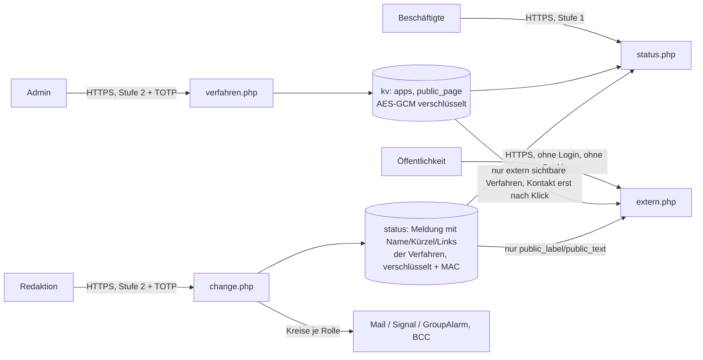

# Fachverfahren und Unternehmensanwendungen

Neben den Meldungen zu Standorten und zur allgemeinen Lage zeigt Status-BCM den Zustand einzelner Fachverfahren
(z. B. E-Akte, Personalverwaltung, Fachportal). Intern nach Anmeldung, auf Wunsch zusätzlich auf einer externen
Seite ohne Login für Bürgerinnen, Kunden und Partner.

## Überblick

| | intern (nach Anmeldung) | extern (ohne Login, standardmäßig aus) |
|---|---|---|
| Welche Verfahren | alle | nur "extern sichtbar" |
| Wann sichtbar | bei Einschränkung immer; "Verfügbar" nur wo "Intern auch Verfügbar anzeigen" | bei Einschränkung; "Verfügbar" nur wo "Extern auch Verfügbar anzeigen" |
| Text | interner Meldungstext (`text`) | allgemeine Fassung (`public_label`, `public_text`), keine Ursachen, keine Details |
| Name, Kürzel | ja | ja |
| Link zur Anmeldung, Doku/Hilfe/Support | ja | nein |
| Kategorie, Bereich | ja | nein |
| DSB-Sensibilität, VSA, KRITIS, Partner | nur mit persönlicher Kennung | nein |
| Kontakt | Rückrufnummer und Kontakte der Meldung | Telefon, E-Mail, Ticket-Link erst nach "Kontakt anzeigen" |
| Übungen | ja (als Übung markiert) | nein |
| Meldungen zu Standorten | ja | nein |

## Pflege (Admins)

Menü **Fachverfahren**. Jede Änderung verlangt Ihren TOTP-Code und steht im Protokoll ("Fachverfahren angelegt/geändert/gelöscht",
mit Name, Einstufung als Merkmal und der Zahl der Kreise je Rolle).

| Feld | Bedeutung |
|---|---|
| Name, Kürzel | Anzeige intern und extern. Es gelten die Regeln für Meldungstexte: keine kritischen Begriffe (`forbidden_terms`). |
| Link zur Anmeldung | `https://…`, intern auf der Statusseite und in der Meldung |
| Link zu Doku, Hilfe, Support | `https://…`, ebenso nur intern |
| Intern auch "Verfügbar" anzeigen | Verfahren erscheint in der Übersicht auch ohne Einschränkung (grün) |
| Auf der externen Statusseite zeigen | Verfahren darf extern erscheinen |
| Extern auch "Verfügbar" anzeigen | extern auch ohne Einschränkung (grün) |
| Kategorie, Bereich | intern für alle Angemeldeten |
| Datenschutz: Sensibilität (DSB) | keine Angabe, normal, hoch, sehr hoch |
| VSA, KRITIS | ja/nein |
| Weitere Partner | Behörden, Unternehmen, die bei Einschränkung mitinformiert werden sollen (Freitext, max. 300 Zeichen) |
| Alarmkreise je Rolle | Verantwortlich, Technik, Betrieb, Nutzende, Partner: je Rolle beliebig viele der Alarmkreise aus **System** |

Die Alarmkreise bringen ihre E-Mail-Adressen, Signal-Empfänger und das GroupAlarm-Szenario mit. Für Partner legen
Sie eigene Kreise an (z. B. "Partner Landesamt"). Wird ein Kreis gelöscht, verschwindet er aus allen Rollen.

## Meldung zu einem Fachverfahren setzen

Im Menü **Einstellungen → Neue Meldung** einen Status mit dem Zusatz "Fachverfahren" wählen und die betroffenen Verfahren
ankreuzen. Mitgeliefert sind:

| Status | Stufe | intern | extern | TOTP |
|---|---|---|---|---|
| Geplante Wartung (`FV_WARTUNG`) | Information | "…werden planmäßig gewartet…" | "Wartung" | nein |
| Fachverfahren eingeschränkt nutzbar (`FV_EINGESCHRAENKT`) | Hinweis | "…nur eingeschränkt nutzbar…" | "Eingeschränkt nutzbar" | ja |
| Fachverfahren nicht verfügbar (`FV_NICHT_VERFUEGBAR`) | Wichtiger Hinweis | "…derzeit nicht nutzbar… Ersatzverfahren…" | "Nicht verfügbar" | ja |

Wie bei allen Meldungen gibt es keinen Freitext. Texte ändern Sie in `config.json` (siehe
[Konfiguration](02-konfiguration.md#felder-eines-status)); "Störung" und "Ausfall" stehen bewusst auf der Liste der
kritischen Begriffe.

**ALARM-Mail:** Unter "Bei Fachverfahren zusätzlich die Kreise dieser Rollen" sind Verantwortlich, Technik, Betrieb und
Nutzende vorausgewählt, Partner nicht. Die Kreise aller Rollen aller gewählten Verfahren werden zusammengeführt;
jede Adresse bekommt die Mail nur einmal, per BCC. Standortverwaltungen werden bei Fachverfahren nicht informiert.

**Vorschau:** Zusätzlich zur Meldung zeigt sie (nur intern)
* Hinweise aus der Einstufung: "KRITIS: Meldepflichten (z. B. BSI) prüfen", "VSA: Geheimschutzbeauftragte informieren",
  "DSB-Sensibilität hoch: Datenschutz einbinden…", "Partner mitinformieren: …",
* was auf der externen Seite erscheinen wird.

Verlängern, ändern (andere Verfahren, Kontakt, Gültigkeit) und beenden funktionieren wie bei jeder Meldung.

## Interne Statusseite

Unter den Meldungen steht der Abschnitt **Fachverfahren**: gestörte Verfahren zuerst (mit Stufe und Statustext), danach
die als "Verfügbar" markierten. Je Verfahren die Links zur Anmeldung und zu Doku/Hilfe/Support, Kategorie und Bereich.
Mit persönlicher Kennung zusätzlich DSB, VSA, KRITIS und Partner. Mit dem gemeinsamen Zugang nicht: Das gemeinsame
Passwort kennen viele, und die Einstufung (z. B. KRITIS, VSA) ist für Angreifer eine Zielliste.

## Externe Statusseite

Adresse: `https://…/extern.php`. Einschalten unter **Fachverfahren → Externe Statusseite**, dort auch Titel, Einleitung,
Rufnummer, E-Mail, Link zum Ticketsystem und Erreichbarkeit. Ist die Seite eingeschaltet, verlinkt die Anmeldeseite sie.

Schutz:
* **Keine Sitzung, kein Cookie.** Die Seite liest nur; sie kann nichts ändern.
* **Nur die allgemeine Fassung:** keine internen Texte, keine Ursachen, keine Standorte, keine Einstufung, keine
  internen Links, keine Übungen, keine nicht verifizierten Meldungen.
* **Kontaktdaten nicht im Quelltext:** Telefon, E-Mail und Ticket-Link erscheinen erst nach Klick auf "Kontakt
  anzeigen". Der Klick sendet ein Formular mit einem zeitgebundenen, signierten Token (frühestens 2 Sekunden, höchstens
  30 Minuten alt) und einem versteckten Feld, das Bots ausfüllen. Adress-Sammler, die nur Seiten abrufen, sehen die
  Daten nicht. Gegen gezieltes Auslesen durch einen Menschen schützt das nicht; nur Funktionsadressen (Servicedesk)
  verwenden, keine persönlichen.
* **Suchmaschinen ausgesperrt:** `noindex` als Header und `robots.txt`; Ticket-Link mit `rel="nofollow"`.
* **Ausgeschaltet = 404.**

## Datenfluss

Die interne Einstufung (DSB, VSA, KRITIS, Partner) wird **nicht** in die Meldung kopiert. Sie bleibt in der
verschlüsselten Verwaltung und wird beim Anzeigen frisch gelesen; ändert ein Admin die Einstufung, gilt sie sofort.
Name, Kürzel und Links werden dagegen mit der Meldung gespeichert, damit eine veröffentlichte Meldung so bleibt, wie sie
veröffentlicht wurde (auch wenn das Verfahren später umbenannt oder gelöscht wird).

## Datenschutz

* **Personenbezug:** gering. Fachverfahren sind Systeme, keine Personen. Personenbezogen sind nur die Adressen in den
  Alarmkreisen (wie bisher verschlüsselt, maskiert, BCC) und gegebenenfalls Kontaktdaten der externen Seite. Dort nur
  Funktionsadressen verwenden; dann entfällt der Personenbezug.
* **Partner:** Freitext mit Organisationsnamen, keine Ansprechpersonen eintragen. Ansprechpersonen gehören als
  Adressen in einen Partner-Kreis (verschlüsselt, maskiert).
* **Externe Seite:** keine Cookies, keine Sitzung, keine externen Ressourcen, keine Zugriffsstatistik. Der Webserver
  des Hosters protokolliert wie bei jeder Seite IP-Adressen (Hoster-Log, siehe [Governance](06-governance.md#7-datenschutz)).
  Ein Hinweis auf die Datenschutzerklärung der Organisation ist auf der externen Seite sinnvoll (Einleitungstext).
* **Verzeichnis von Verarbeitungstätigkeiten:** der bestehende Eintrag deckt die Erweiterung ab; ergänzen: "externe
  Statusseite ohne Login, keine personenbezogene Verarbeitung außer Server-Logs des Hosters".

## Risiken

| Risiko | Bewertung / Gegenmaßnahme |
|---|---|
| Externe Seite verrät Angriffsfläche (welche Systeme gerade nicht laufen) | Bewusst nur Verfahren mit "extern sichtbar", nur allgemeine Texte, keine Ursachen, keine Zeitangaben außer "Stand". Interne Verfahren und Einstufung erscheinen nie extern. *Betreiber:* nur Verfahren extern zeigen, deren Nutzende extern sind. |
| Einstufung (KRITIS, VSA) als Zielliste | Nur mit persönlicher Kennung sichtbar, verschlüsselt gespeichert, nie extern, nicht in Meldungen oder ALARM-Mails. |
| Adress-Sammler auf der externen Seite | Kontaktdaten erst nach Formular-Klick, Honeypot, signiertes Token; nur Funktionsadressen. |
| Viele Aufrufe der externen Seite (Last) | Die Seite liest bei jedem Aufruf Meldungen und Protokoll. Für eine Behörde/ein Unternehmen mit normalem Publikumsverkehr unkritisch; bei erwartbar hoher Last (z. B. Presse) Caching beim Hoster oder ein vorgeschaltetes CDN mit kurzer Lebensdauer erwägen. |
| Falsche Meldung extern sichtbar | Gleiche Schutzmechanismen wie intern: Vorschau, TOTP ab Stufe "Hinweis", Protokoll, MAC je Meldung; nicht verifizierte Meldungen erscheinen extern nicht. |
| Partner werden vergessen | Die Vorschau nennt die Partner des Verfahrens; Partner-Kreise können bei Bedarf angehakt werden. |

## Tests

`php tests/selftest.php` prüft Eingaben, Verschlüsselung, Kreise je Rolle, die Trennung von Meldung und Einstufung,
Übungen und nicht verifizierte Meldungen auf der externen Seite sowie das Kontakt-Token. `php tests/webtest.php`
spielt den Ablauf über HTTP durch: Pflege mit TOTP, externe Seite ohne Cookie und ohne Kontaktdaten im Quelltext,
Bot-Schutz, Meldung mit Alarm an die Rolle Technik, interne Ansicht mit gemeinsamem Zugang (ohne Einstufung) und mit
persönlicher Kennung (mit Einstufung), externe Ansicht nur mit der allgemeinen Fassung.
