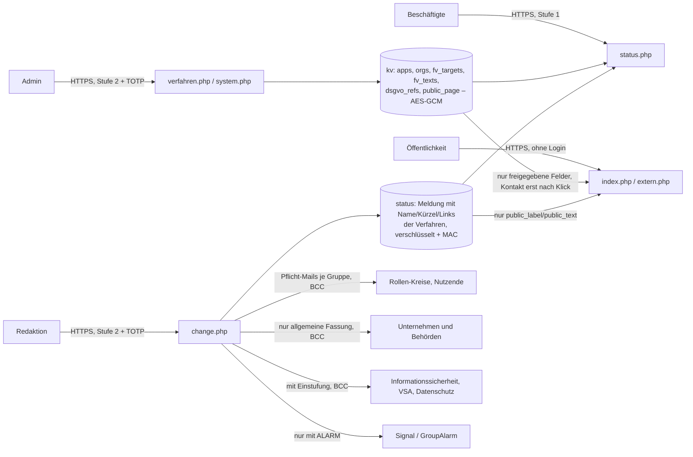

# Fachverfahren und Unternehmensanwendungen

Neben den Meldungen zu Standorten und zur allgemeinen Lage zeigt Status-BCM den Zustand einzelner Fachverfahren
(z. B. E-Akte, Personalverwaltung, Fachportal). Intern nach Anmeldung, auf Wunsch zusätzlich öffentlich ohne Login
auf der Startseite und unter `extern.php`. Jede Meldung zu einem Fachverfahren benachrichtigt automatisch alle
hinterlegten Stellen, jede Gruppe mit ihrem eigenen Infotext.

## Überblick

| | intern (nach Anmeldung) | öffentlich (ohne Login, standardmäßig aus) |
|---|---|---|
| Welche Verfahren | alle | nur "extern sichtbar" |
| Wann sichtbar | bei Einschränkung immer; "Verfügbar" nur wo "Intern auch Verfügbar anzeigen" | bei Einschränkung; "Verfügbar" nur wo "Extern auch Verfügbar anzeigen" |
| Text | interner Meldungstext (`text`) | allgemeine Fassung (`public_label`, `public_text`), keine Ursachen, keine Details |
| Name, Kürzel | ja | je Verfahren wählbar ("Extern sichtbar") |
| Link zur Anmeldung, Doku/Hilfe/Support | ja | je Verfahren wählbar |
| Kategorie, Bereich | ja | nein |
| DSB-Sensibilität, VSA, KRITIS, Unternehmen und Behörden | nur mit persönlicher Kennung | nein |
| Kontakt | Rückrufnummer und Kontakte der Meldung | Telefon, E-Mail, Ticket-Link erst nach "Kontakt anzeigen" |
| Übungen | ja (als Übung markiert) | nein |
| Meldungen zu Standorten | ja | nein |

## Einrichtung (Admins)

Jede Änderung verlangt Ihren TOTP-Code und steht im Protokoll.

**System → Fachverfahren: Zieladressen.** Je eine Adresse für

| Ziel | erhält eine Mail |
|---|---|
| Informationssicherheit | bei jeder Meldung zu einem Fachverfahren |
| VSA (Geheimschutz) | bei Meldungen zu Verfahren mit VSA = ja |
| Datenschutz | bei Meldungen zu Verfahren ab DSB-Stufe "hoch", mit der DSGVO-Referenz der Stufe |

Fehlt eine benötigte Adresse, nennt die Vorschau das, die Meldung wird trotzdem gesetzt, und die Systemprüfung zeigt
einen offenen Punkt.

**System → Unternehmen und Behörden.** Adressbuch mit Name, optionaler Rufnummer und beliebig vielen E-Mail-Adressen
(verschlüsselt, nur maskiert sichtbar). Bitte Funktionspostfächer statt persönlicher Adressen verwenden.

**System → Fachverfahren: Infotexte und DSGVO-Referenzen.** Ein Infotext je Empfängergruppe (steht in der Mail vor der
Meldung) und die DSGVO-Referenz je DSB-Stufe. Leer = Vorbelegung:

| Gruppe | vorbelegter Infotext |
|---|---|
| Verantwortlich, Technik, Betrieb | Bitte prüfen Sie die Auswirkungen in Ihrem Bereich und stimmen Sie das weitere Vorgehen ab. |
| Nutzende | Bitte nutzen Sie bis auf Weiteres die vereinbarten Ersatzverfahren. Wir informieren Sie, sobald die Anwendung wieder wie gewohnt nutzbar ist. |
| Unternehmen und Behörden | Sie erhalten diese Information, weil Sie mit dieser Anwendung zusammenarbeiten. Wir melden uns, sobald sie wieder wie gewohnt nutzbar ist. |
| Informationssicherheit, VSA, Datenschutz | Bitte prüfen Sie, ob Melde- oder Informationspflichten bestehen. |

| DSB-Stufe | vorbelegte DSGVO-Referenz |
|---|---|
| normal | Art. 6 DSGVO (Rechtmäßigkeit der Verarbeitung) |
| hoch | Art. 32 DSGVO (Sicherheit der Verarbeitung), ggf. Art. 33 DSGVO (Meldung an die Aufsichtsbehörde binnen 72 Stunden) |
| sehr hoch | Art. 9 DSGVO (besondere Kategorien), ggf. Art. 33 und 34 DSGVO (Meldung an die Aufsichtsbehörde, Benachrichtigung der Betroffenen) |

Die Vorbelegung ist ein Vorschlag; die passende Rechtsgrundlage legt Ihr Datenschutz fest. Die Texte für Nutzende
sowie Unternehmen und Behörden gehen breit hinaus und werden deshalb wie Meldungstexte auf kritische Begriffe geprüft.

**Fachverfahren** (Menü). Je Verfahren:

| Feld | Bedeutung |
|---|---|
| Name, Kürzel | Anzeige intern; keine kritischen Begriffe (`forbidden_terms`) |
| Link zur Anmeldung, Link zu Doku/Hilfe/Support | `https://…` |
| Intern auch "Verfügbar" anzeigen | Verfahren erscheint in der Übersicht auch ohne Einschränkung (grün) |
| Auf der externen Statusseite zeigen | Verfahren darf öffentlich erscheinen |
| Extern auch "Verfügbar" anzeigen | öffentlich auch ohne Einschränkung (grün) |
| Extern sichtbar: Name, Kürzel, Link zur Anmeldung, Link zu Doku/Hilfe/Support | welche Felder öffentlich erscheinen; Name oder Kürzel ist Pflicht. Neue Verfahren: nur der Name |
| Kategorie, Bereich | intern für alle Angemeldeten |
| Datenschutz: Sensibilität (DSB) | keine Angabe, normal, hoch, sehr hoch |
| VSA, KRITIS | ja/nein |
| Unternehmen und Behörden informieren | Ankreuzliste aus dem Adressbuch |
| Infotext für Nutzende, für Unternehmen und Behörden | optional; ersetzt für dieses Verfahren den Text aus System |
| Alarmkreise je Rolle | Verantwortlich, Technik, Betrieb, Nutzende: je Rolle beliebig viele Alarmkreise aus **System** |

Wird ein Kreis oder ein Adressbuch-Eintrag gelöscht, verschwindet er aus allen Verfahren.

## Meldung zu einem Fachverfahren setzen

Im Menü **Einstellungen → Neue Meldung** einen Status mit dem Zusatz "Fachverfahren" wählen und die betroffenen Verfahren
ankreuzen. Mitgeliefert sind:

| Status | Stufe | intern | öffentlich |
|---|---|---|---|
| Geplante Wartung (`FV_WARTUNG`) | Information | "…werden planmäßig gewartet…" | "Wartung" |
| Fachverfahren eingeschränkt nutzbar (`FV_EINGESCHRAENKT`) | Hinweis | "…nur eingeschränkt nutzbar…" | "Eingeschränkt nutzbar" |
| Fachverfahren nicht verfügbar (`FV_NICHT_VERFUEGBAR`) | Wichtiger Hinweis | "…derzeit nicht nutzbar… Ersatzverfahren…" | "Nicht verfügbar" |

Wie bei allen Meldungen gibt es keinen Freitext. Texte ändern Sie in `config.json` (siehe
[Konfiguration](02-konfiguration.md#felder-eines-status)); "Störung" und "Ausfall" stehen bewusst auf der Liste der
kritischen Begriffe.

**Pflicht-Benachrichtigung.** Jede Meldung zu einem Fachverfahren (setzen, ändern, verlängern, beenden, auch das
automatische Beenden durch den Cron) verschickt ohne weiteres Zutun je Gruppe eine eigene Mail:

| Gruppe | Empfänger | Inhalt |
|---|---|---|
| Verantwortlich, Technik, Betrieb | Kreise dieser Rollen, je Verfahren | Infotext, Meldung (intern), Verfahren mit Links |
| Nutzende | Kreise der Rolle Nutzende, je Verfahren | Infotext (je Verfahren überschreibbar), Meldung (intern), Verfahren mit Links |
| Unternehmen und Behörden | zugeordnete Einträge des Adressbuchs, je Verfahren | Infotext (je Verfahren überschreibbar), **nur** allgemeine Fassung, Kontakt der öffentlichen Seite; nicht bei Übungen |
| Informationssicherheit | Zieladresse | Infotext, Meldung, alle Verfahren mit Einstufung |
| VSA | Zieladresse | nur Verfahren mit VSA |
| Datenschutz | Zieladresse | nur Verfahren ab DSB "hoch", mit DSGVO-Referenz |

An steht die Adresse aus "Adresse im An-Feld der ALARM-Mail"; alle Empfänger stehen nur im BCC. Weil jede Meldung zu
einem Fachverfahren Mails verschickt (auch an Unternehmen und Behörden), verlangt sie immer den TOTP-Code, auch
"Geplante Wartung" und das Beenden.

**ALARM zusätzlich.** Wer ALARM ankreuzt, alarmiert die gewählten Kreise und die Kreise der angehakten Rollen auch über
Signal und GroupAlarm. Wer schon eine Pflicht-Mail bekommt, erhält die ALARM-Mail nicht noch einmal.
Standortverwaltungen werden bei Fachverfahren nicht informiert.

**Vorschau:** Zusätzlich zur Meldung zeigt sie (nur intern)
* Hinweise aus der Einstufung: "KRITIS: Meldepflichten (z. B. BSI) prüfen", "VSA: Geheimschutzbeauftragte informieren",
  "DSB-Sensibilität hoch: Art. 32 DSGVO …",
* jede Empfängergruppe mit der Zahl der Adressen (fehlende Zieladressen rot),
* was öffentlich erscheinen wird.

## Interne Statusseite

Unter den Meldungen steht der Abschnitt **Fachverfahren**: gestörte Verfahren zuerst (mit Stufe und Statustext), danach
die als "Verfügbar" markierten. Je Verfahren die Links zur Anmeldung und zu Doku/Hilfe/Support, Kategorie und Bereich.
Mit persönlicher Kennung zusätzlich DSB, VSA, KRITIS sowie Unternehmen und Behörden. Mit dem gemeinsamen Zugang nicht:
Das gemeinsame Passwort kennen viele, und die Einstufung (z. B. KRITIS, VSA) ist für Angreifer eine Zielliste.

## Öffentliche Ansicht (Startseite und `extern.php`)

Einschalten unter **Fachverfahren → Externe Statusseite**, dort auch Titel, Einleitung, Rufnummer, E-Mail, Link zum
Ticketsystem und Erreichbarkeit. Eingeschaltet steht der öffentliche Status auf der Startseite (Anmeldeseite):

* **Gibt es eine öffentliche Meldung**, steht der Status oben, die Anmeldung rutscht darunter.
* **Sonst** steht die Anmeldung oben, der Status (z. B. "Derzeit liegen keine Meldungen vor" oder die grünen Verfahren)
  darunter.

Dieselbe Ansicht gibt es ohne Anmeldeformular unter `https://…/extern.php` zum Verlinken (z. B. von der Website).

Schutz:
* **`extern.php`: keine Sitzung, kein Cookie.** Die Seite liest nur; sie kann nichts ändern. Die Startseite setzt wie
  bisher nur das Sitzungs-Cookie für die Anmeldung.
* **Nur die allgemeine Fassung und nur freigegebene Felder:** keine internen Texte, keine Ursachen, keine Standorte, keine
  Einstufung, keine Übungen, keine nicht verifizierten Meldungen. Links nur, wo je Verfahren freigegeben, mit
  `rel="nofollow noopener noreferrer"`.
* **Kontaktdaten nicht im Quelltext:** Telefon, E-Mail und Ticket-Link erscheinen erst nach Klick auf "Kontakt
  anzeigen" (auch von der Startseite aus, Ziel `extern.php`). Der Klick sendet ein Formular mit einem zeitgebundenen,
  signierten Token (frühestens 2 Sekunden, höchstens 30 Minuten alt) und einem versteckten Feld, das Bots ausfüllen.
  Adress-Sammler, die nur Seiten abrufen, sehen die Daten nicht. Gegen gezieltes Auslesen durch einen Menschen schützt
  das nicht; nur Funktionsadressen (Servicedesk) verwenden, keine persönlichen.
* **Suchmaschinen ausgesperrt:** `noindex` als Header und `robots.txt`.
* **Ausgeschaltet:** `extern.php` liefert 404, die Startseite zeigt nur die Anmeldung.

## Datenfluss

Die interne Einstufung (DSB, VSA, KRITIS, Unternehmen und Behörden) wird **nicht** in die Meldung kopiert. Sie bleibt
in der verschlüsselten Verwaltung und wird beim Anzeigen und Versenden frisch gelesen; ändert ein Admin die Einstufung,
gilt sie sofort. Name, Kürzel und Links werden dagegen mit der Meldung gespeichert, damit eine veröffentlichte Meldung
so bleibt, wie sie veröffentlicht wurde. Im Mail-Protokoll stehen Betreff und Text verschlüsselt, die Empfänger nur
maskiert; das Audit-Log nennt je Gruppe nur die Zahl der Adressen.

## Datenschutz

* **Personenbezug:** gering. Fachverfahren sind Systeme, keine Personen. Personenbezogen sind die Adressen in den
  Alarmkreisen, im Adressbuch und die Zieladressen (verschlüsselt, maskiert, nur BCC) sowie gegebenenfalls Kontaktdaten
  der öffentlichen Seite. Überall Funktionspostfächer verwenden; dann entfällt der Personenbezug weitgehend.
* **Unternehmen und Behörden:** erhalten nur die allgemeine Fassung, keine internen Texte, keine Einstufung, keine
  Übungen, keine internen Links. Die Weitergabe an Dritte (Art. 6 DSGVO) betrifft nur den Zustand eines Systems, nicht
  personenbezogene Daten.
* **Öffentliche Ansicht:** keine externen Ressourcen, keine Zugriffsstatistik; `extern.php` ohne Cookies. Der Webserver
  des Hosters protokolliert wie bei jeder Seite IP-Adressen (Hoster-Log, siehe [Governance](06-governance.md#7-datenschutz)).
  Ein Hinweis auf die Datenschutzerklärung der Organisation ist sinnvoll (Einleitungstext).
* **Verzeichnis von Verarbeitungstätigkeiten:** ergänzen um "Benachrichtigung von Unternehmen und Behörden
  (Funktionsadressen) bei Einschränkungen von Fachverfahren" und "öffentliche Statusansicht ohne Login".

## Risiken

| Risiko | Bewertung / Gegenmaßnahme |
|---|---|
| Öffentliche Ansicht verrät Angriffsfläche (welche Systeme gerade nicht laufen) | Nur Verfahren mit "extern sichtbar", nur freigegebene Felder, nur allgemeine Texte, keine Ursachen, keine Zeitangaben außer "Stand". Interne Verfahren und Einstufung erscheinen nie öffentlich. *Betreiber:* nur Verfahren zeigen, deren Nutzende extern sind; Kürzel und Links nur freigeben, wenn sie öffentlich bekannt sind. |
| Einstufung (KRITIS, VSA) als Zielliste | Nur mit persönlicher Kennung sichtbar, verschlüsselt gespeichert, nie öffentlich, nicht in Meldungen; per Mail nur an Informationssicherheit, VSA und Datenschutz. |
| Mail an Unternehmen und Behörden enthält zu viel | Nur `public_label`/`public_text`, Name und Kürzel, Infotext und öffentlicher Kontakt; keine Übungen. Infotexte werden auf kritische Begriffe geprüft. |
| Pflicht-Mail erreicht nicht alle | Vorschau zeigt jede Gruppe mit Zahl der Adressen und fehlende Zieladressen; Ergebnis je Adresse (maskiert) im Mail-Protokoll; Systemprüfung meldet fehlende Zieladressen. |
| Ungewollte Benachrichtigung nach außen | Jede Meldung zu einem Fachverfahren verlangt Vorschau und TOTP-Code; die Vorschau nennt die Unternehmen und Behörden. |
| Adress-Sammler auf der öffentlichen Ansicht | Kontaktdaten erst nach Formular-Klick, Honeypot, signiertes Token; nur Funktionsadressen. |
| Viele Aufrufe (Last) | Startseite und `extern.php` lesen bei jedem Aufruf Meldungen und Protokoll. Bei normalem Publikumsverkehr unkritisch; bei erwartbar hoher Last (z. B. Presse) `extern.php` verlinken und beim Hoster cachen. |
| Falsche Meldung öffentlich sichtbar | Gleiche Schutzmechanismen wie intern: Vorschau, TOTP, Protokoll, MAC je Meldung; nicht verifizierte Meldungen erscheinen nicht. |

## Tests

`php tests/selftest.php` prüft Eingaben, Verschlüsselung, Adressbuch, Zieladressen, Infotexte und DSGVO-Referenzen,
die freigegebenen Felder, die Pflicht-Mails je Gruppe (Inhalt, nur BCC, keine Einstufung nach außen, keine Übungen an
Unternehmen und Behörden, keine doppelte ALARM-Mail), die Trennung von Meldung und Einstufung sowie das Kontakt-Token.
`php tests/webtest.php` spielt den Ablauf über HTTP durch: Pflege mit TOTP, öffentliche Ansicht ohne Cookie und ohne
Kontaktdaten im Quelltext, Bot-Schutz, Startseite mit und ohne öffentliche Meldung, Vorschau mit allen Gruppen,
Versand und Inhalt der Mails, interne Ansicht mit gemeinsamem Zugang (ohne Einstufung) und mit persönlicher Kennung.
